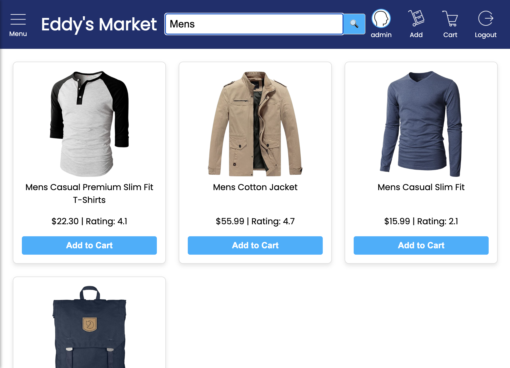
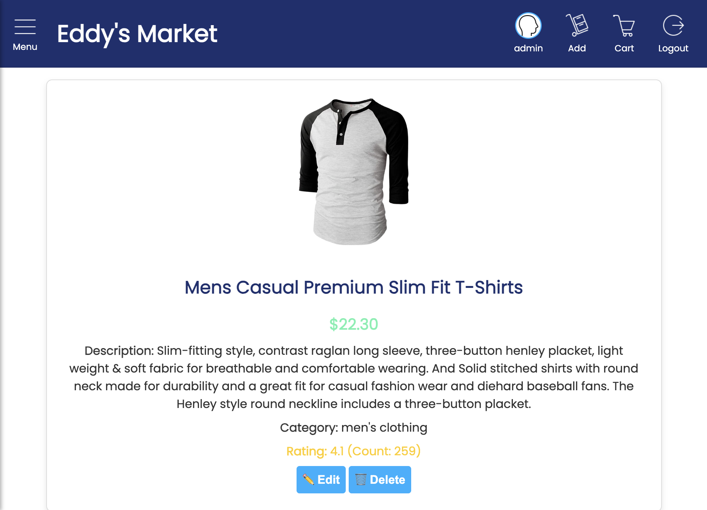

# Eddy's Market - Resell E-Commerce Platform

A full-stack e-commerce web application built with Spring Boot and MySQL, featuring product management, user authentication, and shopping cart functionality.

## Features

- **Product Management**: Browse, add, edit, and delete products
- **User Authentication**: User registration and login system
- **Shopping Cart**: Add products to cart and manage purchases
- **Responsive Design**: Mobile-friendly interface with hamburger menu
- **Category Filtering**: Products organized by categories (Men's Clothing, Women's Clothing, Electronics, Jewelry)
- **Product Ratings**: Display and manage product ratings and reviews

## Tech Stack

- **Backend**: Spring Boot 3.5.5, Java 24
- **Database**: MySQL 8.0
- **Frontend**: HTML5, CSS3, JavaScript
- **Template Engine**: Thymeleaf
- **Build Tool**: Maven
- **ORM**: Spring Data JPA (Hibernate)

## Screenshots
### Home Page
#### User View

#### Logged-in User View

#### Admin User View


#### Search Functionality

### Product Page

### Cart Page

### User Profile Page

### User Registration

### User Login


## Project Structure

```
resell-ecommerce/
├── src/main/java/com/ecruz/resell_ecommerce/
│   ├── cart/           # Cart management
│   ├── product/        # Product management
│   ├── user/           # User management
│   └── ResellEcommerceApplication.java
├── src/main/resources/
│   ├── static/         # CSS, JS, and images
│   ├── templates/      # HTML templates
│   └── application.properties
└── ecommerce_database.sql
```

## Prerequisites

- Java 24 or higher
- MySQL 8.0 or higher
- Maven 3.6 or higher

## Setup Instructions

### 1. Clone the Repository
```bash
git clone <repository-url>
cd resell-ecommerce
```

### 2. Database Setup
```bash
# Login to MySQL
mysql -u root -p

# Create database and import data
source ecommerce_database.sql
```

### 3. Configure Database Connection
Update `src/main/resources/application.properties`:
```properties
spring.datasource.url=jdbc:mysql://localhost:3306/ecommerce_database?useSSL=true&serverTimezone=UTC
spring.datasource.username=your_username
spring.datasource.password=your_password
```

### 4. Build and Run
```bash
# Build the project
mvn clean install

# Run the application
mvn spring-boot:run
```

The application will be available at `http://localhost:8080`

## API Endpoints

### Products
- `GET /api/products` - Get all products
- `GET /api/products/{id}` - Get product by ID
- `POST /api/products` - Create new product
- `PUT /api/products/{id}` - Update product
- `DELETE /api/products/{id}` - Delete product

### Users
- `POST /api/users/register` - Register new user
- `POST /api/users/login` - User login
- `GET /api/users/{id}` - Get user profile

### Cart
- `GET /api/cart/{userId}` - Get user's cart
- `POST /api/cart` - Add item to cart
- `DELETE /api/cart/{id}` - Remove item from cart

## Database Schema

### Products Table
- `id` (Primary Key)
- `title` (VARCHAR)
- `price` (DECIMAL)
- `description` (TEXT)
- `category` (VARCHAR)
- `image_url` (TEXT)
- `count` (INT) - Stock count
- `rate` (DECIMAL) - Average rating

